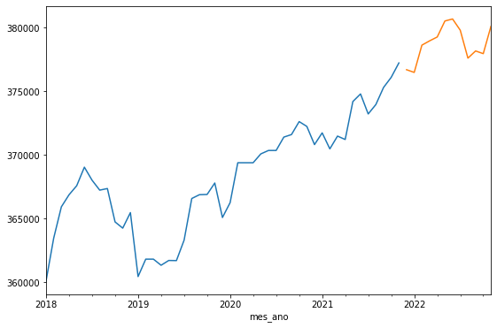

  <h1>EDA e previsão de séries temporais com Databricks e Apache Spark</h1>

  

  

_________________

### Dados
Base de dados: Produção de etanol anidro e hidratado
Fonte: Portal brasileiro de dados abertos
  
### Tecnologias
Databricks e Spark

### Insights
  
- O Sudeste concentrou a maior capacidade produtiva de etanol (56%), seguida do Centro-oeste (30%). A menor capacidade produtiva foi observada no Norte (1%). Observa-se ainda, tendencia de queda da capacidade produtiva no Nordeste e no Sul.
- São Paulo, o maior produtor, produziu nos últimos anos cerca de 2,75 vezes mais que o segundo colocado Goiás. Este fato pode ser explicado pela extensa área plantada de cana-de-açúcar no estado, principal matéria prima para a produção do etanol. 
- Estima-se que no fim de 2022 haja um pequeno crescimento na capacidade produtiva (<1%), bem como na tancagem. Em contrapartida a produção deve sofrer queda. A tendencia de queda da produção pode ter sido ocasionada pela diminuição da demanda do etanol observada durante a pandemia do novo coronavírus, em decorrência da menor mobilidade.
- Para a produção, além da cana de açúcar (96%), usou-se o melaço (3%) e o milho (2%) para gerar etanol, o último com tendencia de crescimento, indicando ser uma matéria prima em potencial.
